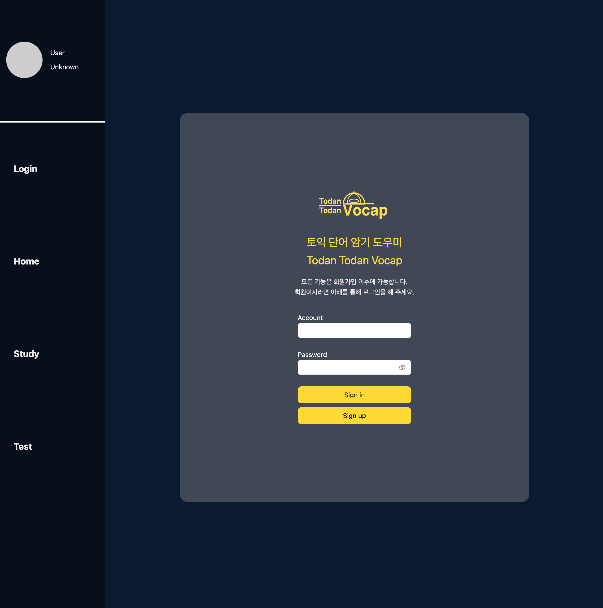
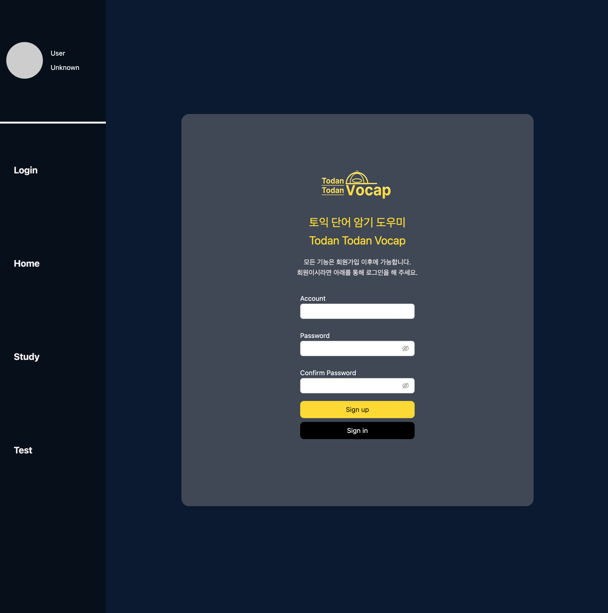
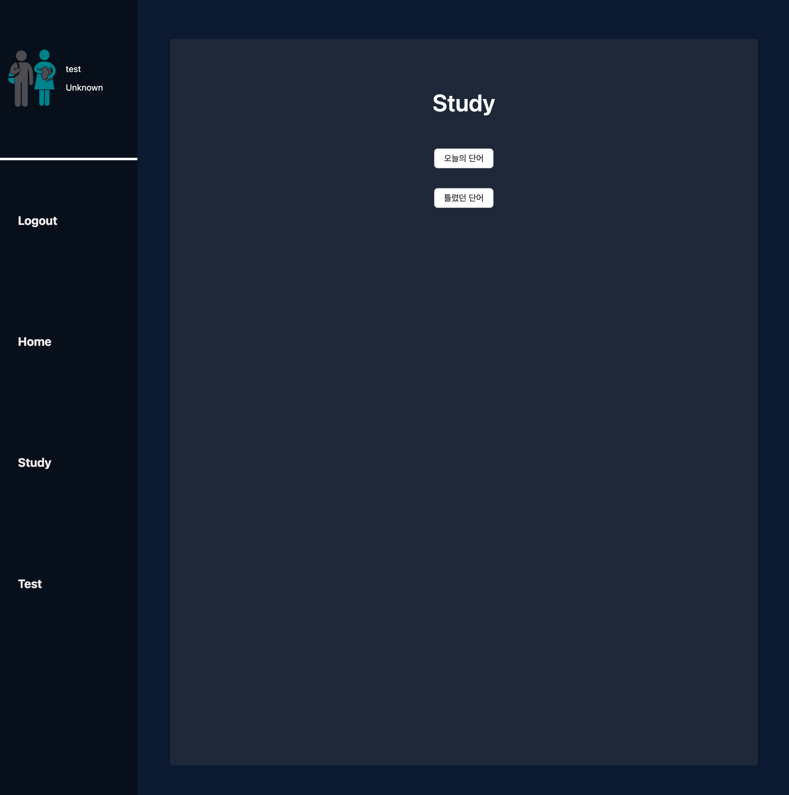
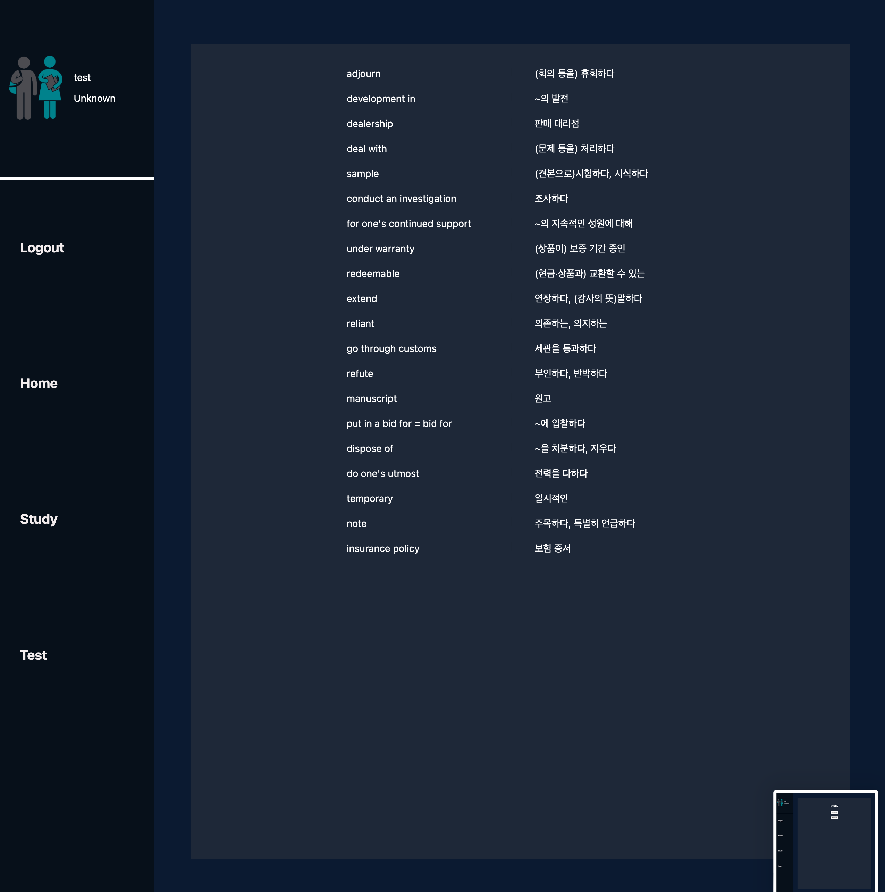
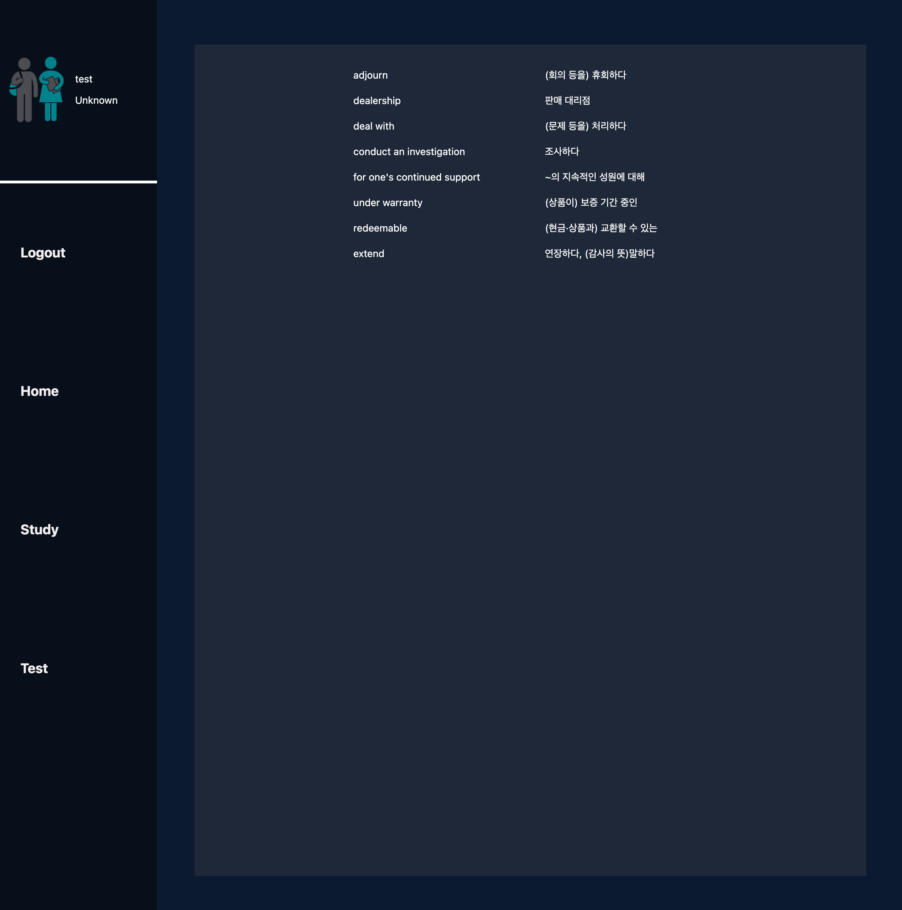
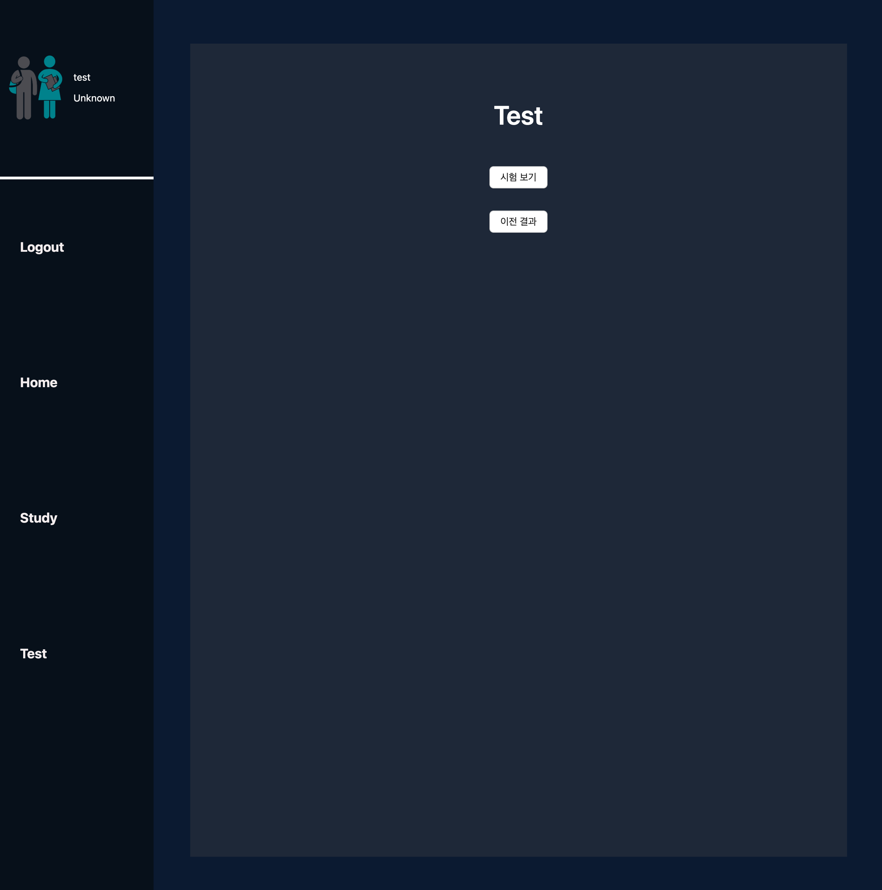
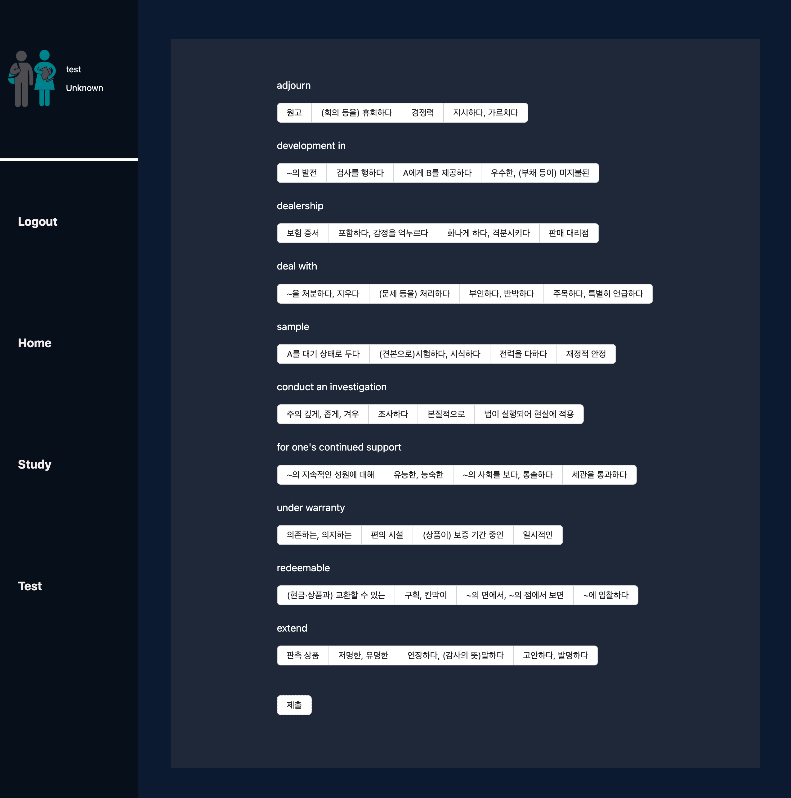
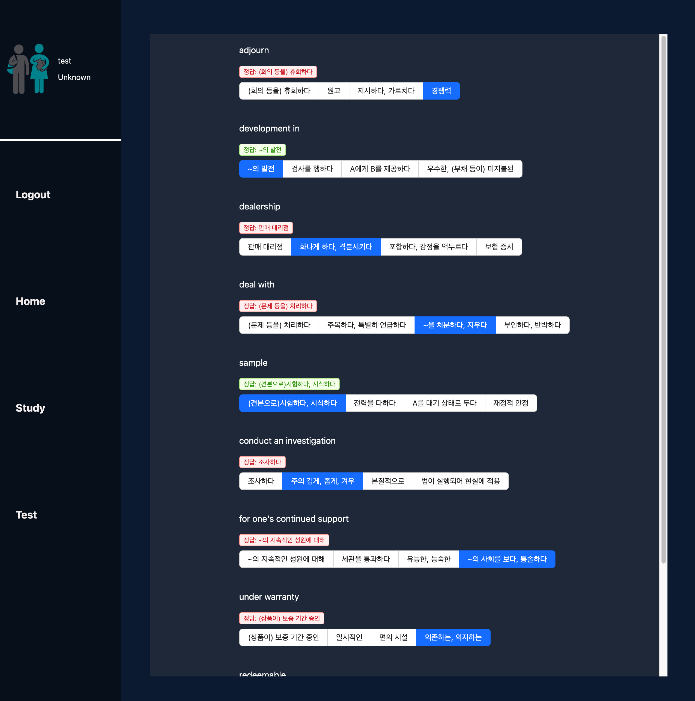

# vocabulary

## 영단어를 공부하고 테스트 볼 수 있는 사이트

### 기술 스택

서버: Spring Boot, Jpa, H2  
프론트: React

### 경험

- 지인의 부탁으로 만들게된 사이트 입니다.
- 협업 과정을 간접적으로 체험할 수 있었습니다.
- 다음과 같은 과정을 통해 만들었습니다.
  - 기본적인 질문
    - 어떤 사이트가 필요한지
      - 영단어를 공부하고 시험 볼 수 있는 사이트
    - 어느정도의 기간 내에 만들어야 하는지
      - 5일 이내
  - 필요한 기능 질문
    - 영단어 공부
      - 영단어 공부는 단순히 단어를 보여주면 되는지
        - 단어를 단순히 보여주면 되는데 난이도 별로 나눠서 보여주면 더 좋을 것 같다.
      - 단어 데이터가 있는지, 난이도가 구분되어 있는지
        - 조금이지만 단어 데이터가 있고 난이도가 구분되어 있지 않음
      - 난이도를 구분해줄 수 있는지
        - 이 부분은 차후에 가능하다면 진행하는 걸로
    - 영단어 시험
      - 공부 페이지에서 보여줬던 단어들을 시험보면 되는건지
      - 객관식, 주관식 중에 어떤 형식으로 시험을 낼건지
        - 주관식이면 좋겠지만 어렵다면 객관식이여도 괜찮다.
      - 주관식으로 낸다면 다양한 답 제출이 가능해서 어디까지 맞는걸로 채점할지에 대한 기준이 필요할텐데 이러한 기준이 있는지  
        ex) 정확하게 공부 페이지에서 적혀있던 답만 정답으로 허용 혹은 답의 일부만 작성해도 정답 처리 등
        - 채점 기준이 없고, 복잡해질 것 같아서 그냥 객관식으로 하는게 좋을 것 같다.
      - 객관식이라면 문제와 선택지를 만들어서 줄 것인지 아니면 제공해준 단어 데이터에서 랜덤으로 단어를 뽑아서 선택지로 만들면 될지
        - 랜덤으로 단어를 뽑아서 선택지로 만들면 될 것 같다.
      - 시험 채점 이후에 이전 시험 결과를 조회할 건지
        - 조회가 가능하면 좋을 것 같다.
  - 추가 내용
    - 시험에서 틀린 단어를 보여주면 좋을 것 같다.

### 작동

- 로그인 페이지
  - 로그인
    
  - 회원가입
    
- 공부 페이지
  - 공부 메뉴
    
  - 단어 공부  
    
  - 틀렸던 단어  
    
- 시험 페이지
  - 시험 메뉴
    
  - 시험  
    
  - 시험 결과
    
  - 이전 시험 결과  
    
